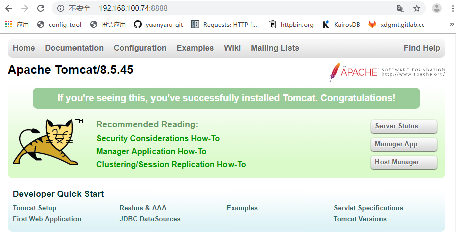

#### 下载开源 war 包或者使用自己的应用 war 包
https://gitee.com/GalaIO/jpress/blob/master/wars/jpress-web-newest.war

#### 拉取 tomcat ，已包含 jdk
``` bash
$ docker pull tomcat
```

#### 拉取 mysql
``` bash
$ docker pull mysql
```

#### 编写 Dockerfile
``` bash
[root@nodeb2 docker]# cat Dockerfile 
from tomcat
MAINTAINER yyr xxx.@163.com
COPY jpress-web-newest.war /usr/local/tomcat/webapps
```

#### 构建镜像
``` bash
[root@nodeb4 docker]# docker build -t jpress .
Sending build context to Docker daemon  20.73MB
Step 1/3 : FROM tomcat
 ---> 96c4e536d0eb
Step 2/3 : MAINTAINER yyr xxx.@163.com
 ---> Running in f9ba599cdf11
 ---> 3b645a478bcd
Removing intermediate container f9ba599cdf11
Step 3/3 : COPY jpress-web-newest.war /usr/local/tomcat/webapps
 ---> d8669c042cca
Removing intermediate container 1b5f2d2b7448
Successfully built d8669c042cca
Successfully tagged jpress:latest
``` 
``` bash
[root@nodeb4 docker]# docker images
REPOSITORY          TAG                 IMAGE ID            CREATED             SIZE
jpress              latest              d8669c042cca        12 seconds ago      527MB
tomcat              latest              96c4e536d0eb        7 days ago          506MB
mysql               latest              62a9f311b99c        2 weeks ago         445MB
```

#### 运行镜像
* 启动tomcat
``` bash
[root@nodeb4 docker]# docker run -d -p 8888:8080 jpress
a80aec4ef41a8c1fdac7025b4112585643ed581dfd17c99cd2369a2a81e03d31
```
* 启动mysql
``` bash
[root@nodeb4 docker]# docker run -d -p 3306:3306 -e MYSQL_ROOT_PASSWORD=root -e MYSQL_DATABASE=jpress mysql
67a3c97a41c71115fb3397689eaf0e172c655b1493c251751f24be745715dd6e
``` 

#### 查看进程
``` bash
[root@nodeb4 yyr]# docker ps
CONTAINER ID        IMAGE               COMMAND                  CREATED             STATUS              PORTS                               NAMES
67a3c97a41c7        mysql               "docker-entrypoint..."   6 seconds ago       Up 4 seconds        0.0.0.0:3306->3306/tcp, 33060/tcp   upbeat_shockley
a80aec4ef41a        jpress              "catalina.sh run"        42 seconds ago      Up 39 seconds       0.0.0.0:8888->8080/tcp              gallant_archimedes
```

#### 访问 tomcat
http://192.168.100.74:8888


#### 访问应用 jpress
http://192.168.100.74:8888/jpress-web-newest


#### 在本地访问 docker 中启动的 mysql


解决方法：
``` bash
mysql> [root@nodeb4 ~]# docker exec -it 67a3c97a41c7 bash
root@67a3c97a41c7:/# mysql -u root -p
mysql> alter user 'root'@'%' identified with mysql_native_password by 'root';
Query OK, 0 rows affected (0.25 sec)
```
成功访问：


用 navicat 工具连接数据库：

